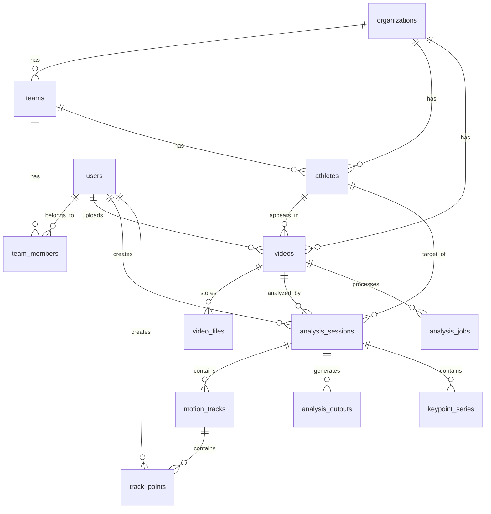

# Sports Analytics バックエンド設計

## 概要

本ドキュメントは、スポーツ動画分析プロダクト向けの実践的なバックエンド設計をまとめたものです。前提は以下の通りです。

- フロントエンド: Flutter
- バックエンド API: FastAPI
- ORM: SQLAlchemy 2.x
- マイグレーション: Alembic
- データベース: PostgreSQL
- ファイル保存: Amazon S3
- MVP の主機能: 動画アップロード、手動ポイント打ち、時系列ポイント保存、軌跡表示
- 将来拡張: 自動姿勢推定、非同期解析ジョブ、高機能な管理画面

この設計では、以下を明確に分離しています。

- ユーザー、組織、選手、動画といった業務エンティティ
- 手動分析データであるトラックとトラックポイント
- 将来の自動解析データであるジョブやキーポイント出力

---

## 推奨ディレクトリ構成

```text
backend/
  app/
    api/
      v1/
        routers/
    core/
      config.py
      security.py
    db/
      base.py
      session.py
    models/
      user.py
      organization.py
      team.py
      athlete.py
      video.py
      analysis.py
    schemas/
      auth.py
      user.py
      athlete.py
      video.py
      analysis.py
    services/
      video_service.py
      analysis_service.py
      track_service.py
    repositories/
      user_repository.py
      athlete_repository.py
      video_repository.py
      analysis_repository.py
    main.py
  alembic/
    versions/
  tests/
```

---

## ドメインモデル概要

### 主要エンティティ

- `users`: 認証ユーザー
- `organizations`: 学校、クラブ、アカデミーなどの上位組織
- `teams`: 組織配下のチーム
- `team_members`: チーム所属と権限
- `athletes`: 分析対象の選手
- `videos`: アップロードされた動画メタデータ
- `video_files`: S3 上の実ファイル情報
- `analysis_sessions`: 特定動画に対する分析作業単位
- `motion_tracks`: 右膝、頭頂などの軌跡対象
- `track_points`: 手動または補間で記録された時系列座標

### 将来拡張エンティティ

- `analysis_jobs`: 非同期解析ジョブ
- `analysis_outputs`: 解析結果サマリ
- `keypoint_series`: 姿勢推定モデルの出力系列
- `tags`, `video_tags`: メタデータ分類
- `audit_logs`: 操作監査ログ

---

## ER図



---

## SQLAlchemy モデル定義案

以下は、SQLAlchemy 2.x の typed declarative mapping を使った実装案です。

```python
from __future__ import annotations

import enum
import uuid
from datetime import date, datetime
from decimal import Decimal

from sqlalchemy import (
    BigInteger,
    Boolean,
    CheckConstraint,
    Date,
    DateTime,
    Enum,
    ForeignKey,
    Index,
    Integer,
    Numeric,
    String,
    Text,
    UniqueConstraint,
    func,
)
from sqlalchemy.dialects.postgresql import JSONB, UUID
from sqlalchemy.orm import DeclarativeBase, Mapped, mapped_column, relationship


class Base(DeclarativeBase):
    pass


class TimestampMixin:
    created_at: Mapped[datetime] = mapped_column(
        DateTime(timezone=True), server_default=func.now(), nullable=False
    )
    updated_at: Mapped[datetime] = mapped_column(
        DateTime(timezone=True), server_default=func.now(), onupdate=func.now(), nullable=False
    )


class UserRole(str, enum.Enum):
    admin = "admin"
    coach = "coach"
    analyst = "analyst"
    athlete = "athlete"


class TeamMemberRole(str, enum.Enum):
    owner = "owner"
    coach = "coach"
    manager = "manager"
    viewer = "viewer"


class VideoStatus(str, enum.Enum):
    uploaded = "uploaded"
    processing = "processing"
    ready = "ready"
    failed = "failed"


class AnalysisSessionStatus(str, enum.Enum):
    draft = "draft"
    in_progress = "in_progress"
    completed = "completed"
    archived = "archived"


class PointSourceType(str, enum.Enum):
    manual = "manual"
    interpolated = "interpolated"
    auto_detected = "auto_detected"


class AnalysisJobStatus(str, enum.Enum):
    queued = "queued"
    running = "running"
    succeeded = "succeeded"
    failed = "failed"


class Organization(Base, TimestampMixin):
    __tablename__ = "organizations"

    id: Mapped[uuid.UUID] = mapped_column(UUID(as_uuid=True), primary_key=True, default=uuid.uuid4)
    name: Mapped[str] = mapped_column(String(255), nullable=False)
    slug: Mapped[str] = mapped_column(String(255), unique=True, nullable=False)
    plan_type: Mapped[str] = mapped_column(String(50), nullable=False, default="free")

    teams: Mapped[list[Team]] = relationship(back_populates="organization")
    athletes: Mapped[list[Athlete]] = relationship(back_populates="organization")
    videos: Mapped[list[Video]] = relationship(back_populates="organization")


class User(Base, TimestampMixin):
    __tablename__ = "users"

    id: Mapped[uuid.UUID] = mapped_column(UUID(as_uuid=True), primary_key=True, default=uuid.uuid4)
    email: Mapped[str] = mapped_column(String(320), unique=True, nullable=False, index=True)
    password_hash: Mapped[str | None] = mapped_column(String(255), nullable=True)
    display_name: Mapped[str] = mapped_column(String(255), nullable=False)
    role: Mapped[UserRole] = mapped_column(Enum(UserRole, name="user_role"), nullable=False)
    is_active: Mapped[bool] = mapped_column(Boolean, default=True, nullable=False)
    last_login_at: Mapped[datetime | None] = mapped_column(DateTime(timezone=True), nullable=True)

    team_memberships: Mapped[list[TeamMember]] = relationship(back_populates="user")
    uploaded_videos: Mapped[list[Video]] = relationship(back_populates="uploaded_by_user")
    analysis_sessions: Mapped[list[AnalysisSession]] = relationship(back_populates="created_by_user")
    created_track_points: Mapped[list[TrackPoint]] = relationship(back_populates="created_by_user")


class Team(Base, TimestampMixin):
    __tablename__ = "teams"

    id: Mapped[uuid.UUID] = mapped_column(UUID(as_uuid=True), primary_key=True, default=uuid.uuid4)
    organization_id: Mapped[uuid.UUID] = mapped_column(
        UUID(as_uuid=True), ForeignKey("organizations.id", ondelete="CASCADE"), nullable=False, index=True
    )
    name: Mapped[str] = mapped_column(String(255), nullable=False)
    sport_type: Mapped[str] = mapped_column(String(100), nullable=False)
    season_label: Mapped[str | None] = mapped_column(String(100), nullable=True)

    organization: Mapped[Organization] = relationship(back_populates="teams")
    members: Mapped[list[TeamMember]] = relationship(back_populates="team")
    athletes: Mapped[list[Athlete]] = relationship(back_populates="team")


class TeamMember(Base):
    __tablename__ = "team_members"
    __table_args__ = (UniqueConstraint("team_id", "user_id", name="uq_team_members_team_user"),)

    id: Mapped[uuid.UUID] = mapped_column(UUID(as_uuid=True), primary_key=True, default=uuid.uuid4)
    team_id: Mapped[uuid.UUID] = mapped_column(
        UUID(as_uuid=True), ForeignKey("teams.id", ondelete="CASCADE"), nullable=False, index=True
    )
    user_id: Mapped[uuid.UUID] = mapped_column(
        UUID(as_uuid=True), ForeignKey("users.id", ondelete="CASCADE"), nullable=False, index=True
    )
    membership_role: Mapped[TeamMemberRole] = mapped_column(
        Enum(TeamMemberRole, name="team_member_role"), nullable=False
    )
    created_at: Mapped[datetime] = mapped_column(
        DateTime(timezone=True), server_default=func.now(), nullable=False
    )

    team: Mapped[Team] = relationship(back_populates="members")
    user: Mapped[User] = relationship(back_populates="team_memberships")


class Athlete(Base, TimestampMixin):
    __tablename__ = "athletes"

    id: Mapped[uuid.UUID] = mapped_column(UUID(as_uuid=True), primary_key=True, default=uuid.uuid4)
    organization_id: Mapped[uuid.UUID] = mapped_column(
        UUID(as_uuid=True), ForeignKey("organizations.id", ondelete="CASCADE"), nullable=False, index=True
    )
    team_id: Mapped[uuid.UUID | None] = mapped_column(
        UUID(as_uuid=True), ForeignKey("teams.id", ondelete="SET NULL"), nullable=True, index=True
    )
    external_code: Mapped[str | None] = mapped_column(String(100), nullable=True)
    name: Mapped[str] = mapped_column(String(255), nullable=False)
    kana_name: Mapped[str | None] = mapped_column(String(255), nullable=True)
    birth_date: Mapped[date | None] = mapped_column(Date, nullable=True)
    sex: Mapped[str | None] = mapped_column(String(30), nullable=True)
    dominant_side: Mapped[str | None] = mapped_column(String(20), nullable=True)
    position_name: Mapped[str | None] = mapped_column(String(100), nullable=True)
    height_cm: Mapped[Decimal | None] = mapped_column(Numeric(5, 2), nullable=True)
    weight_kg: Mapped[Decimal | None] = mapped_column(Numeric(5, 2), nullable=True)
    note: Mapped[str | None] = mapped_column(Text, nullable=True)

    organization: Mapped[Organization] = relationship(back_populates="athletes")
    team: Mapped[Team | None] = relationship(back_populates="athletes")
    videos: Mapped[list[Video]] = relationship(back_populates="athlete")
    analysis_sessions: Mapped[list[AnalysisSession]] = relationship(back_populates="athlete")


class Video(Base, TimestampMixin):
    __tablename__ = "videos"
    __table_args__ = (
        Index("ix_videos_org_team_athlete", "organization_id", "team_id", "athlete_id"),
    )

    id: Mapped[uuid.UUID] = mapped_column(UUID(as_uuid=True), primary_key=True, default=uuid.uuid4)
    organization_id: Mapped[uuid.UUID] = mapped_column(
        UUID(as_uuid=True), ForeignKey("organizations.id", ondelete="CASCADE"), nullable=False, index=True
    )
    team_id: Mapped[uuid.UUID | None] = mapped_column(
        UUID(as_uuid=True), ForeignKey("teams.id", ondelete="SET NULL"), nullable=True, index=True
    )
    athlete_id: Mapped[uuid.UUID | None] = mapped_column(
        UUID(as_uuid=True), ForeignKey("athletes.id", ondelete="SET NULL"), nullable=True, index=True
    )
    uploaded_by_user_id: Mapped[uuid.UUID] = mapped_column(
        UUID(as_uuid=True), ForeignKey("users.id", ondelete="RESTRICT"), nullable=False, index=True
    )
    title: Mapped[str] = mapped_column(String(255), nullable=False)
    description: Mapped[str | None] = mapped_column(Text, nullable=True)
    sport_type: Mapped[str] = mapped_column(String(100), nullable=False)
    capture_date: Mapped[date | None] = mapped_column(Date, nullable=True)
    recorded_at: Mapped[datetime | None] = mapped_column(DateTime(timezone=True), nullable=True)
    camera_view: Mapped[str | None] = mapped_column(String(50), nullable=True)
    frame_rate: Mapped[Decimal | None] = mapped_column(Numeric(8, 3), nullable=True)
    duration_ms: Mapped[int | None] = mapped_column(BigInteger, nullable=True)
    status: Mapped[VideoStatus] = mapped_column(Enum(VideoStatus, name="video_status"), nullable=False)

    organization: Mapped[Organization] = relationship(back_populates="videos")
    athlete: Mapped[Athlete | None] = relationship(back_populates="videos")
    uploaded_by_user: Mapped[User] = relationship(back_populates="uploaded_videos")
    files: Mapped[list[VideoFile]] = relationship(back_populates="video")
    analysis_sessions: Mapped[list[AnalysisSession]] = relationship(back_populates="video")
    analysis_jobs: Mapped[list[AnalysisJob]] = relationship(back_populates="video")


class VideoFile(Base):
    __tablename__ = "video_files"

    id: Mapped[uuid.UUID] = mapped_column(UUID(as_uuid=True), primary_key=True, default=uuid.uuid4)
    video_id: Mapped[uuid.UUID] = mapped_column(
        UUID(as_uuid=True), ForeignKey("videos.id", ondelete="CASCADE"), nullable=False, index=True
    )
    file_type: Mapped[str] = mapped_column(String(50), nullable=False)
    storage_provider: Mapped[str] = mapped_column(String(50), nullable=False, default="s3")
    bucket_name: Mapped[str] = mapped_column(String(255), nullable=False)
    object_key: Mapped[str] = mapped_column(String(1024), nullable=False)
    file_name: Mapped[str] = mapped_column(String(255), nullable=False)
    mime_type: Mapped[str] = mapped_column(String(100), nullable=False)
    file_size_bytes: Mapped[int] = mapped_column(BigInteger, nullable=False)
    width_px: Mapped[int | None] = mapped_column(Integer, nullable=True)
    height_px: Mapped[int | None] = mapped_column(Integer, nullable=True)
    checksum_sha256: Mapped[str | None] = mapped_column(String(64), nullable=True)
    created_at: Mapped[datetime] = mapped_column(
        DateTime(timezone=True), server_default=func.now(), nullable=False
    )

    video: Mapped[Video] = relationship(back_populates="files")


class AnalysisSession(Base, TimestampMixin):
    __tablename__ = "analysis_sessions"

    id: Mapped[uuid.UUID] = mapped_column(UUID(as_uuid=True), primary_key=True, default=uuid.uuid4)
    video_id: Mapped[uuid.UUID] = mapped_column(
        UUID(as_uuid=True), ForeignKey("videos.id", ondelete="CASCADE"), nullable=False, index=True
    )
    athlete_id: Mapped[uuid.UUID | None] = mapped_column(
        UUID(as_uuid=True), ForeignKey("athletes.id", ondelete="SET NULL"), nullable=True, index=True
    )
    created_by_user_id: Mapped[uuid.UUID] = mapped_column(
        UUID(as_uuid=True), ForeignKey("users.id", ondelete="RESTRICT"), nullable=False, index=True
    )
    session_name: Mapped[str] = mapped_column(String(255), nullable=False)
    analysis_type: Mapped[str] = mapped_column(String(100), nullable=False)
    status: Mapped[AnalysisSessionStatus] = mapped_column(
        Enum(AnalysisSessionStatus, name="analysis_session_status"), nullable=False
    )
    note: Mapped[str | None] = mapped_column(Text, nullable=True)

    video: Mapped[Video] = relationship(back_populates="analysis_sessions")
    athlete: Mapped[Athlete | None] = relationship(back_populates="analysis_sessions")
    created_by_user: Mapped[User] = relationship(back_populates="analysis_sessions")
    motion_tracks: Mapped[list[MotionTrack]] = relationship(back_populates="analysis_session")
    outputs: Mapped[list[AnalysisOutput]] = relationship(back_populates="analysis_session")
    keypoint_series: Mapped[list[KeypointSeries]] = relationship(back_populates="analysis_session")


class MotionTrack(Base, TimestampMixin):
    __tablename__ = "motion_tracks"

    id: Mapped[uuid.UUID] = mapped_column(UUID(as_uuid=True), primary_key=True, default=uuid.uuid4)
    analysis_session_id: Mapped[uuid.UUID] = mapped_column(
        UUID(as_uuid=True), ForeignKey("analysis_sessions.id", ondelete="CASCADE"), nullable=False, index=True
    )
    name: Mapped[str] = mapped_column(String(255), nullable=False)
    body_part: Mapped[str | None] = mapped_column(String(100), nullable=True)
    color_hex: Mapped[str] = mapped_column(String(7), nullable=False)
    sort_order: Mapped[int] = mapped_column(Integer, nullable=False, default=0)
    is_visible: Mapped[bool] = mapped_column(Boolean, nullable=False, default=True)

    analysis_session: Mapped[AnalysisSession] = relationship(back_populates="motion_tracks")
    points: Mapped[list[TrackPoint]] = relationship(back_populates="motion_track")


class TrackPoint(Base):
    __tablename__ = "track_points"
    __table_args__ = (
        CheckConstraint("x_norm >= 0 AND x_norm <= 1", name="ck_track_points_x_norm_range"),
        CheckConstraint("y_norm >= 0 AND y_norm <= 1", name="ck_track_points_y_norm_range"),
        Index("ix_track_points_track_time", "motion_track_id", "time_ms"),
    )

    id: Mapped[uuid.UUID] = mapped_column(UUID(as_uuid=True), primary_key=True, default=uuid.uuid4)
    motion_track_id: Mapped[uuid.UUID] = mapped_column(
        UUID(as_uuid=True), ForeignKey("motion_tracks.id", ondelete="CASCADE"), nullable=False, index=True
    )
    frame_index: Mapped[int | None] = mapped_column(Integer, nullable=True)
    time_ms: Mapped[int] = mapped_column(BigInteger, nullable=False)
    x_norm: Mapped[Decimal] = mapped_column(Numeric(8, 6), nullable=False)
    y_norm: Mapped[Decimal] = mapped_column(Numeric(8, 6), nullable=False)
    confidence: Mapped[Decimal | None] = mapped_column(Numeric(5, 4), nullable=True)
    source_type: Mapped[PointSourceType] = mapped_column(
        Enum(PointSourceType, name="point_source_type"), nullable=False
    )
    created_by_user_id: Mapped[uuid.UUID | None] = mapped_column(
        UUID(as_uuid=True), ForeignKey("users.id", ondelete="SET NULL"), nullable=True, index=True
    )
    created_at: Mapped[datetime] = mapped_column(
        DateTime(timezone=True), server_default=func.now(), nullable=False
    )

    motion_track: Mapped[MotionTrack] = relationship(back_populates="points")
    created_by_user: Mapped[User | None] = relationship(back_populates="created_track_points")


class AnalysisJob(Base):
    __tablename__ = "analysis_jobs"

    id: Mapped[uuid.UUID] = mapped_column(UUID(as_uuid=True), primary_key=True, default=uuid.uuid4)
    video_id: Mapped[uuid.UUID] = mapped_column(
        UUID(as_uuid=True), ForeignKey("videos.id", ondelete="CASCADE"), nullable=False, index=True
    )
    analysis_session_id: Mapped[uuid.UUID | None] = mapped_column(
        UUID(as_uuid=True), ForeignKey("analysis_sessions.id", ondelete="SET NULL"), nullable=True, index=True
    )
    job_type: Mapped[str] = mapped_column(String(100), nullable=False)
    status: Mapped[AnalysisJobStatus] = mapped_column(
        Enum(AnalysisJobStatus, name="analysis_job_status"), nullable=False
    )
    requested_by_user_id: Mapped[uuid.UUID] = mapped_column(
        UUID(as_uuid=True), ForeignKey("users.id", ondelete="RESTRICT"), nullable=False, index=True
    )
    worker_name: Mapped[str | None] = mapped_column(String(100), nullable=True)
    started_at: Mapped[datetime | None] = mapped_column(DateTime(timezone=True), nullable=True)
    finished_at: Mapped[datetime | None] = mapped_column(DateTime(timezone=True), nullable=True)
    error_message: Mapped[str | None] = mapped_column(Text, nullable=True)
    created_at: Mapped[datetime] = mapped_column(
        DateTime(timezone=True), server_default=func.now(), nullable=False
    )

    video: Mapped[Video] = relationship(back_populates="analysis_jobs")


class AnalysisOutput(Base):
    __tablename__ = "analysis_outputs"

    id: Mapped[uuid.UUID] = mapped_column(UUID(as_uuid=True), primary_key=True, default=uuid.uuid4)
    analysis_session_id: Mapped[uuid.UUID] = mapped_column(
        UUID(as_uuid=True), ForeignKey("analysis_sessions.id", ondelete="CASCADE"), nullable=False, index=True
    )
    output_type: Mapped[str] = mapped_column(String(100), nullable=False)
    title: Mapped[str] = mapped_column(String(255), nullable=False)
    payload_json: Mapped[dict] = mapped_column(JSONB, nullable=False)
    version: Mapped[int] = mapped_column(Integer, nullable=False, default=1)
    created_at: Mapped[datetime] = mapped_column(
        DateTime(timezone=True), server_default=func.now(), nullable=False
    )

    analysis_session: Mapped[AnalysisSession] = relationship(back_populates="outputs")


class KeypointSeries(Base):
    __tablename__ = "keypoint_series"
    __table_args__ = (
        CheckConstraint("x_norm >= 0 AND x_norm <= 1", name="ck_keypoint_series_x_norm_range"),
        CheckConstraint("y_norm >= 0 AND y_norm <= 1", name="ck_keypoint_series_y_norm_range"),
        Index("ix_keypoint_series_session_time", "analysis_session_id", "time_ms"),
    )

    id: Mapped[uuid.UUID] = mapped_column(UUID(as_uuid=True), primary_key=True, default=uuid.uuid4)
    analysis_session_id: Mapped[uuid.UUID] = mapped_column(
        UUID(as_uuid=True), ForeignKey("analysis_sessions.id", ondelete="CASCADE"), nullable=False, index=True
    )
    model_name: Mapped[str] = mapped_column(String(100), nullable=False)
    keypoint_name: Mapped[str] = mapped_column(String(100), nullable=False)
    frame_index: Mapped[int] = mapped_column(Integer, nullable=False)
    time_ms: Mapped[int] = mapped_column(BigInteger, nullable=False)
    x_norm: Mapped[Decimal] = mapped_column(Numeric(8, 6), nullable=False)
    y_norm: Mapped[Decimal] = mapped_column(Numeric(8, 6), nullable=False)
    z_norm: Mapped[Decimal | None] = mapped_column(Numeric(8, 6), nullable=True)
    confidence: Mapped[Decimal | None] = mapped_column(Numeric(5, 4), nullable=True)
    created_at: Mapped[datetime] = mapped_column(
        DateTime(timezone=True), server_default=func.now(), nullable=False
    )

    analysis_session: Mapped[AnalysisSession] = relationship(back_populates="keypoint_series")
```

---

## Alembic 初期マイグレーション案

以下は、MVP の主要テーブルと将来拡張向けテーブルをまとめて作成する初期マイグレーション案です。

```python
"""initial backend schema

Revision ID: 0001_initial_schema
Revises: 
Create Date: 2026-03-29 00:00:00.000000
"""

from alembic import op
import sqlalchemy as sa
from sqlalchemy.dialects import postgresql


revision = "0001_initial_schema"
down_revision = None
branch_labels = None
depends_on = None


user_role = sa.Enum("admin", "coach", "analyst", "athlete", name="user_role")
team_member_role = sa.Enum("owner", "coach", "manager", "viewer", name="team_member_role")
video_status = sa.Enum("uploaded", "processing", "ready", "failed", name="video_status")
analysis_session_status = sa.Enum(
    "draft", "in_progress", "completed", "archived", name="analysis_session_status"
)
point_source_type = sa.Enum(
    "manual", "interpolated", "auto_detected", name="point_source_type"
)
analysis_job_status = sa.Enum(
    "queued", "running", "succeeded", "failed", name="analysis_job_status"
)


def upgrade() -> None:
    bind = op.get_bind()
    user_role.create(bind, checkfirst=True)
    team_member_role.create(bind, checkfirst=True)
    video_status.create(bind, checkfirst=True)
    analysis_session_status.create(bind, checkfirst=True)
    point_source_type.create(bind, checkfirst=True)
    analysis_job_status.create(bind, checkfirst=True)

    op.create_table(
        "organizations",
        sa.Column("id", postgresql.UUID(as_uuid=True), primary_key=True, nullable=False),
        sa.Column("name", sa.String(length=255), nullable=False),
        sa.Column("slug", sa.String(length=255), nullable=False),
        sa.Column("plan_type", sa.String(length=50), nullable=False),
        sa.Column("created_at", sa.DateTime(timezone=True), server_default=sa.func.now(), nullable=False),
        sa.Column("updated_at", sa.DateTime(timezone=True), server_default=sa.func.now(), nullable=False),
        sa.UniqueConstraint("slug", name="uq_organizations_slug"),
    )

    op.create_table(
        "users",
        sa.Column("id", postgresql.UUID(as_uuid=True), primary_key=True, nullable=False),
        sa.Column("email", sa.String(length=320), nullable=False),
        sa.Column("password_hash", sa.String(length=255), nullable=True),
        sa.Column("display_name", sa.String(length=255), nullable=False),
        sa.Column("role", user_role, nullable=False),
        sa.Column("is_active", sa.Boolean(), nullable=False, server_default=sa.text("true")),
        sa.Column("last_login_at", sa.DateTime(timezone=True), nullable=True),
        sa.Column("created_at", sa.DateTime(timezone=True), server_default=sa.func.now(), nullable=False),
        sa.Column("updated_at", sa.DateTime(timezone=True), server_default=sa.func.now(), nullable=False),
    )
    op.create_index("ix_users_email", "users", ["email"], unique=True)

    op.create_table(
        "teams",
        sa.Column("id", postgresql.UUID(as_uuid=True), primary_key=True, nullable=False),
        sa.Column("organization_id", postgresql.UUID(as_uuid=True), nullable=False),
        sa.Column("name", sa.String(length=255), nullable=False),
        sa.Column("sport_type", sa.String(length=100), nullable=False),
        sa.Column("season_label", sa.String(length=100), nullable=True),
        sa.Column("created_at", sa.DateTime(timezone=True), server_default=sa.func.now(), nullable=False),
        sa.Column("updated_at", sa.DateTime(timezone=True), server_default=sa.func.now(), nullable=False),
        sa.ForeignKeyConstraint(["organization_id"], ["organizations.id"], ondelete="CASCADE"),
    )
    op.create_index("ix_teams_organization_id", "teams", ["organization_id"], unique=False)

    op.create_table(
        "team_members",
        sa.Column("id", postgresql.UUID(as_uuid=True), primary_key=True, nullable=False),
        sa.Column("team_id", postgresql.UUID(as_uuid=True), nullable=False),
        sa.Column("user_id", postgresql.UUID(as_uuid=True), nullable=False),
        sa.Column("membership_role", team_member_role, nullable=False),
        sa.Column("created_at", sa.DateTime(timezone=True), server_default=sa.func.now(), nullable=False),
        sa.ForeignKeyConstraint(["team_id"], ["teams.id"], ondelete="CASCADE"),
        sa.ForeignKeyConstraint(["user_id"], ["users.id"], ondelete="CASCADE"),
        sa.UniqueConstraint("team_id", "user_id", name="uq_team_members_team_user"),
    )
    op.create_index("ix_team_members_team_id", "team_members", ["team_id"], unique=False)
    op.create_index("ix_team_members_user_id", "team_members", ["user_id"], unique=False)

    op.create_table(
        "athletes",
        sa.Column("id", postgresql.UUID(as_uuid=True), primary_key=True, nullable=False),
        sa.Column("organization_id", postgresql.UUID(as_uuid=True), nullable=False),
        sa.Column("team_id", postgresql.UUID(as_uuid=True), nullable=True),
        sa.Column("external_code", sa.String(length=100), nullable=True),
        sa.Column("name", sa.String(length=255), nullable=False),
        sa.Column("kana_name", sa.String(length=255), nullable=True),
        sa.Column("birth_date", sa.Date(), nullable=True),
        sa.Column("sex", sa.String(length=30), nullable=True),
        sa.Column("dominant_side", sa.String(length=20), nullable=True),
        sa.Column("position_name", sa.String(length=100), nullable=True),
        sa.Column("height_cm", sa.Numeric(5, 2), nullable=True),
        sa.Column("weight_kg", sa.Numeric(5, 2), nullable=True),
        sa.Column("note", sa.Text(), nullable=True),
        sa.Column("created_at", sa.DateTime(timezone=True), server_default=sa.func.now(), nullable=False),
        sa.Column("updated_at", sa.DateTime(timezone=True), server_default=sa.func.now(), nullable=False),
        sa.ForeignKeyConstraint(["organization_id"], ["organizations.id"], ondelete="CASCADE"),
        sa.ForeignKeyConstraint(["team_id"], ["teams.id"], ondelete="SET NULL"),
    )
    op.create_index("ix_athletes_organization_id", "athletes", ["organization_id"], unique=False)
    op.create_index("ix_athletes_team_id", "athletes", ["team_id"], unique=False)

    op.create_table(
        "videos",
        sa.Column("id", postgresql.UUID(as_uuid=True), primary_key=True, nullable=False),
        sa.Column("organization_id", postgresql.UUID(as_uuid=True), nullable=False),
        sa.Column("team_id", postgresql.UUID(as_uuid=True), nullable=True),
        sa.Column("athlete_id", postgresql.UUID(as_uuid=True), nullable=True),
        sa.Column("uploaded_by_user_id", postgresql.UUID(as_uuid=True), nullable=False),
        sa.Column("title", sa.String(length=255), nullable=False),
        sa.Column("description", sa.Text(), nullable=True),
        sa.Column("sport_type", sa.String(length=100), nullable=False),
        sa.Column("capture_date", sa.Date(), nullable=True),
        sa.Column("recorded_at", sa.DateTime(timezone=True), nullable=True),
        sa.Column("camera_view", sa.String(length=50), nullable=True),
        sa.Column("frame_rate", sa.Numeric(8, 3), nullable=True),
        sa.Column("duration_ms", sa.BigInteger(), nullable=True),
        sa.Column("status", video_status, nullable=False),
        sa.Column("created_at", sa.DateTime(timezone=True), server_default=sa.func.now(), nullable=False),
        sa.Column("updated_at", sa.DateTime(timezone=True), server_default=sa.func.now(), nullable=False),
        sa.ForeignKeyConstraint(["organization_id"], ["organizations.id"], ondelete="CASCADE"),
        sa.ForeignKeyConstraint(["team_id"], ["teams.id"], ondelete="SET NULL"),
        sa.ForeignKeyConstraint(["athlete_id"], ["athletes.id"], ondelete="SET NULL"),
        sa.ForeignKeyConstraint(["uploaded_by_user_id"], ["users.id"], ondelete="RESTRICT"),
    )
    op.create_index("ix_videos_organization_id", "videos", ["organization_id"], unique=False)
    op.create_index("ix_videos_team_id", "videos", ["team_id"], unique=False)
    op.create_index("ix_videos_athlete_id", "videos", ["athlete_id"], unique=False)
    op.create_index("ix_videos_uploaded_by_user_id", "videos", ["uploaded_by_user_id"], unique=False)
    op.create_index(
        "ix_videos_org_team_athlete",
        "videos",
        ["organization_id", "team_id", "athlete_id"],
        unique=False,
    )

    op.create_table(
        "video_files",
        sa.Column("id", postgresql.UUID(as_uuid=True), primary_key=True, nullable=False),
        sa.Column("video_id", postgresql.UUID(as_uuid=True), nullable=False),
        sa.Column("file_type", sa.String(length=50), nullable=False),
        sa.Column("storage_provider", sa.String(length=50), nullable=False),
        sa.Column("bucket_name", sa.String(length=255), nullable=False),
        sa.Column("object_key", sa.String(length=1024), nullable=False),
        sa.Column("file_name", sa.String(length=255), nullable=False),
        sa.Column("mime_type", sa.String(length=100), nullable=False),
        sa.Column("file_size_bytes", sa.BigInteger(), nullable=False),
        sa.Column("width_px", sa.Integer(), nullable=True),
        sa.Column("height_px", sa.Integer(), nullable=True),
        sa.Column("checksum_sha256", sa.String(length=64), nullable=True),
        sa.Column("created_at", sa.DateTime(timezone=True), server_default=sa.func.now(), nullable=False),
        sa.ForeignKeyConstraint(["video_id"], ["videos.id"], ondelete="CASCADE"),
    )
    op.create_index("ix_video_files_video_id", "video_files", ["video_id"], unique=False)

    op.create_table(
        "analysis_sessions",
        sa.Column("id", postgresql.UUID(as_uuid=True), primary_key=True, nullable=False),
        sa.Column("video_id", postgresql.UUID(as_uuid=True), nullable=False),
        sa.Column("athlete_id", postgresql.UUID(as_uuid=True), nullable=True),
        sa.Column("created_by_user_id", postgresql.UUID(as_uuid=True), nullable=False),
        sa.Column("session_name", sa.String(length=255), nullable=False),
        sa.Column("analysis_type", sa.String(length=100), nullable=False),
        sa.Column("status", analysis_session_status, nullable=False),
        sa.Column("note", sa.Text(), nullable=True),
        sa.Column("created_at", sa.DateTime(timezone=True), server_default=sa.func.now(), nullable=False),
        sa.Column("updated_at", sa.DateTime(timezone=True), server_default=sa.func.now(), nullable=False),
        sa.ForeignKeyConstraint(["video_id"], ["videos.id"], ondelete="CASCADE"),
        sa.ForeignKeyConstraint(["athlete_id"], ["athletes.id"], ondelete="SET NULL"),
        sa.ForeignKeyConstraint(["created_by_user_id"], ["users.id"], ondelete="RESTRICT"),
    )
    op.create_index("ix_analysis_sessions_video_id", "analysis_sessions", ["video_id"], unique=False)
    op.create_index("ix_analysis_sessions_athlete_id", "analysis_sessions", ["athlete_id"], unique=False)
    op.create_index("ix_analysis_sessions_created_by_user_id", "analysis_sessions", ["created_by_user_id"], unique=False)

    op.create_table(
        "motion_tracks",
        sa.Column("id", postgresql.UUID(as_uuid=True), primary_key=True, nullable=False),
        sa.Column("analysis_session_id", postgresql.UUID(as_uuid=True), nullable=False),
        sa.Column("name", sa.String(length=255), nullable=False),
        sa.Column("body_part", sa.String(length=100), nullable=True),
        sa.Column("color_hex", sa.String(length=7), nullable=False),
        sa.Column("sort_order", sa.Integer(), nullable=False, server_default="0"),
        sa.Column("is_visible", sa.Boolean(), nullable=False, server_default=sa.text("true")),
        sa.Column("created_at", sa.DateTime(timezone=True), server_default=sa.func.now(), nullable=False),
        sa.Column("updated_at", sa.DateTime(timezone=True), server_default=sa.func.now(), nullable=False),
        sa.ForeignKeyConstraint(["analysis_session_id"], ["analysis_sessions.id"], ondelete="CASCADE"),
    )
    op.create_index("ix_motion_tracks_analysis_session_id", "motion_tracks", ["analysis_session_id"], unique=False)

    op.create_table(
        "track_points",
        sa.Column("id", postgresql.UUID(as_uuid=True), primary_key=True, nullable=False),
        sa.Column("motion_track_id", postgresql.UUID(as_uuid=True), nullable=False),
        sa.Column("frame_index", sa.Integer(), nullable=True),
        sa.Column("time_ms", sa.BigInteger(), nullable=False),
        sa.Column("x_norm", sa.Numeric(8, 6), nullable=False),
        sa.Column("y_norm", sa.Numeric(8, 6), nullable=False),
        sa.Column("confidence", sa.Numeric(5, 4), nullable=True),
        sa.Column("source_type", point_source_type, nullable=False),
        sa.Column("created_by_user_id", postgresql.UUID(as_uuid=True), nullable=True),
        sa.Column("created_at", sa.DateTime(timezone=True), server_default=sa.func.now(), nullable=False),
        sa.CheckConstraint("x_norm >= 0 AND x_norm <= 1", name="ck_track_points_x_norm_range"),
        sa.CheckConstraint("y_norm >= 0 AND y_norm <= 1", name="ck_track_points_y_norm_range"),
        sa.ForeignKeyConstraint(["motion_track_id"], ["motion_tracks.id"], ondelete="CASCADE"),
        sa.ForeignKeyConstraint(["created_by_user_id"], ["users.id"], ondelete="SET NULL"),
    )
    op.create_index("ix_track_points_motion_track_id", "track_points", ["motion_track_id"], unique=False)
    op.create_index("ix_track_points_created_by_user_id", "track_points", ["created_by_user_id"], unique=False)
    op.create_index("ix_track_points_track_time", "track_points", ["motion_track_id", "time_ms"], unique=False)

    op.create_table(
        "analysis_jobs",
        sa.Column("id", postgresql.UUID(as_uuid=True), primary_key=True, nullable=False),
        sa.Column("video_id", postgresql.UUID(as_uuid=True), nullable=False),
        sa.Column("analysis_session_id", postgresql.UUID(as_uuid=True), nullable=True),
        sa.Column("job_type", sa.String(length=100), nullable=False),
        sa.Column("status", analysis_job_status, nullable=False),
        sa.Column("requested_by_user_id", postgresql.UUID(as_uuid=True), nullable=False),
        sa.Column("worker_name", sa.String(length=100), nullable=True),
        sa.Column("started_at", sa.DateTime(timezone=True), nullable=True),
        sa.Column("finished_at", sa.DateTime(timezone=True), nullable=True),
        sa.Column("error_message", sa.Text(), nullable=True),
        sa.Column("created_at", sa.DateTime(timezone=True), server_default=sa.func.now(), nullable=False),
        sa.ForeignKeyConstraint(["video_id"], ["videos.id"], ondelete="CASCADE"),
        sa.ForeignKeyConstraint(["analysis_session_id"], ["analysis_sessions.id"], ondelete="SET NULL"),
        sa.ForeignKeyConstraint(["requested_by_user_id"], ["users.id"], ondelete="RESTRICT"),
    )
    op.create_index("ix_analysis_jobs_video_id", "analysis_jobs", ["video_id"], unique=False)
    op.create_index("ix_analysis_jobs_analysis_session_id", "analysis_jobs", ["analysis_session_id"], unique=False)
    op.create_index("ix_analysis_jobs_requested_by_user_id", "analysis_jobs", ["requested_by_user_id"], unique=False)

    op.create_table(
        "analysis_outputs",
        sa.Column("id", postgresql.UUID(as_uuid=True), primary_key=True, nullable=False),
        sa.Column("analysis_session_id", postgresql.UUID(as_uuid=True), nullable=False),
        sa.Column("output_type", sa.String(length=100), nullable=False),
        sa.Column("title", sa.String(length=255), nullable=False),
        sa.Column("payload_json", postgresql.JSONB(astext_type=sa.Text()), nullable=False),
        sa.Column("version", sa.Integer(), nullable=False, server_default="1"),
        sa.Column("created_at", sa.DateTime(timezone=True), server_default=sa.func.now(), nullable=False),
        sa.ForeignKeyConstraint(["analysis_session_id"], ["analysis_sessions.id"], ondelete="CASCADE"),
    )
    op.create_index("ix_analysis_outputs_analysis_session_id", "analysis_outputs", ["analysis_session_id"], unique=False)

    op.create_table(
        "keypoint_series",
        sa.Column("id", postgresql.UUID(as_uuid=True), primary_key=True, nullable=False),
        sa.Column("analysis_session_id", postgresql.UUID(as_uuid=True), nullable=False),
        sa.Column("model_name", sa.String(length=100), nullable=False),
        sa.Column("keypoint_name", sa.String(length=100), nullable=False),
        sa.Column("frame_index", sa.Integer(), nullable=False),
        sa.Column("time_ms", sa.BigInteger(), nullable=False),
        sa.Column("x_norm", sa.Numeric(8, 6), nullable=False),
        sa.Column("y_norm", sa.Numeric(8, 6), nullable=False),
        sa.Column("z_norm", sa.Numeric(8, 6), nullable=True),
        sa.Column("confidence", sa.Numeric(5, 4), nullable=True),
        sa.Column("created_at", sa.DateTime(timezone=True), server_default=sa.func.now(), nullable=False),
        sa.CheckConstraint("x_norm >= 0 AND x_norm <= 1", name="ck_keypoint_series_x_norm_range"),
        sa.CheckConstraint("y_norm >= 0 AND y_norm <= 1", name="ck_keypoint_series_y_norm_range"),
        sa.ForeignKeyConstraint(["analysis_session_id"], ["analysis_sessions.id"], ondelete="CASCADE"),
    )
    op.create_index("ix_keypoint_series_analysis_session_id", "keypoint_series", ["analysis_session_id"], unique=False)
    op.create_index("ix_keypoint_series_session_time", "keypoint_series", ["analysis_session_id", "time_ms"], unique=False)


def downgrade() -> None:
    op.drop_index("ix_keypoint_series_session_time", table_name="keypoint_series")
    op.drop_index("ix_keypoint_series_analysis_session_id", table_name="keypoint_series")
    op.drop_table("keypoint_series")

    op.drop_index("ix_analysis_outputs_analysis_session_id", table_name="analysis_outputs")
    op.drop_table("analysis_outputs")

    op.drop_index("ix_analysis_jobs_requested_by_user_id", table_name="analysis_jobs")
    op.drop_index("ix_analysis_jobs_analysis_session_id", table_name="analysis_jobs")
    op.drop_index("ix_analysis_jobs_video_id", table_name="analysis_jobs")
    op.drop_table("analysis_jobs")

    op.drop_index("ix_track_points_track_time", table_name="track_points")
    op.drop_index("ix_track_points_created_by_user_id", table_name="track_points")
    op.drop_index("ix_track_points_motion_track_id", table_name="track_points")
    op.drop_table("track_points")

    op.drop_index("ix_motion_tracks_analysis_session_id", table_name="motion_tracks")
    op.drop_table("motion_tracks")

    op.drop_index("ix_analysis_sessions_created_by_user_id", table_name="analysis_sessions")
    op.drop_index("ix_analysis_sessions_athlete_id", table_name="analysis_sessions")
    op.drop_index("ix_analysis_sessions_video_id", table_name="analysis_sessions")
    op.drop_table("analysis_sessions")

    op.drop_index("ix_video_files_video_id", table_name="video_files")
    op.drop_table("video_files")

    op.drop_index("ix_videos_org_team_athlete", table_name="videos")
    op.drop_index("ix_videos_uploaded_by_user_id", table_name="videos")
    op.drop_index("ix_videos_athlete_id", table_name="videos")
    op.drop_index("ix_videos_team_id", table_name="videos")
    op.drop_index("ix_videos_organization_id", table_name="videos")
    op.drop_table("videos")

    op.drop_index("ix_athletes_team_id", table_name="athletes")
    op.drop_index("ix_athletes_organization_id", table_name="athletes")
    op.drop_table("athletes")

    op.drop_index("ix_team_members_user_id", table_name="team_members")
    op.drop_index("ix_team_members_team_id", table_name="team_members")
    op.drop_table("team_members")

    op.drop_index("ix_teams_organization_id", table_name="teams")
    op.drop_table("teams")

    op.drop_index("ix_users_email", table_name="users")
    op.drop_table("users")

    op.drop_table("organizations")

    bind = op.get_bind()
    analysis_job_status.drop(bind, checkfirst=True)
    point_source_type.drop(bind, checkfirst=True)
    analysis_session_status.drop(bind, checkfirst=True)
    video_status.drop(bind, checkfirst=True)
    team_member_role.drop(bind, checkfirst=True)
    user_role.drop(bind, checkfirst=True)
```

---

## FastAPI CRUD API 設計

API はバージョニングし、集約単位ごとに整理する構成を推奨します。

### 認証

#### POST `/api/v1/auth/login`
- 用途: アクセストークンとリフレッシュトークンを発行する
- リクエスト:

```json
{
  "email": "coach@example.com",
  "password": "secret"
}
```

- レスポンス:

```json
{
  "access_token": "...",
  "refresh_token": "...",
  "token_type": "bearer"
}
```

#### POST `/api/v1/auth/refresh`
- 用途: アクセストークンを再発行する

#### GET `/api/v1/auth/me`
- 用途: 現在ログイン中のユーザー情報を取得する

---

### 組織・チーム

#### GET `/api/v1/organizations`
- 現在のユーザーが参照可能な組織一覧を返す

#### GET `/api/v1/teams`
- クエリパラメータ:
  - `organization_id`
  - `sport_type`
- チーム一覧を返す

#### POST `/api/v1/teams`
- チームを作成する

#### PATCH `/api/v1/teams/{team_id}`
- チーム情報を更新する

---

### 選手

#### GET `/api/v1/athletes`
- クエリパラメータ:
  - `organization_id`
  - `team_id`
  - `q`
  - `limit`
  - `offset`

#### POST `/api/v1/athletes`
- 選手を作成する

#### GET `/api/v1/athletes/{athlete_id}`
- 選手詳細を取得する

#### PATCH `/api/v1/athletes/{athlete_id}`
- 選手情報を更新する

#### DELETE `/api/v1/athletes/{athlete_id}`
- 本番運用ではソフトデリート推奨。MVP の内部運用では物理削除でも可

選手レスポンス例:

```json
{
  "id": "uuid",
  "name": "Yamada Taro",
  "team_id": "uuid",
  "dominant_side": "right",
  "position_name": "sprinter"
}
```

---

### 動画

#### POST `/api/v1/videos`
- 動画の論理レコードを作成する
- 必要に応じてプリサインアップロードURLの事前発行にも拡張可能

リクエスト:

```json
{
  "organization_id": "uuid",
  "team_id": "uuid",
  "athlete_id": "uuid",
  "title": "100m start trial 01",
  "sport_type": "athletics",
  "camera_view": "side"
}
```

レスポンス:

```json
{
  "id": "uuid",
  "status": "uploaded"
}
```

#### POST `/api/v1/videos/{video_id}/files/presign`
- 元動画アップロード用の S3 プリサインURLを発行する

レスポンス:

```json
{
  "bucket": "my-bucket",
  "object_key": "videos/org-1/video-1/original.mp4",
  "upload_url": "https://..."
}
```

#### POST `/api/v1/videos/{video_id}/complete-upload`
- アップロード完了を確定し、`video_files` を保存する

#### GET `/api/v1/videos`
- クエリパラメータ:
  - `organization_id`
  - `team_id`
  - `athlete_id`
  - `status`
  - `limit`
  - `offset`

#### GET `/api/v1/videos/{video_id}`
- 1件の動画を取得する

#### PATCH `/api/v1/videos/{video_id}`
- タイトル、説明、撮影メタデータなどを更新する

#### DELETE `/api/v1/videos/{video_id}`
- アーカイブまたは削除する

---

### 解析セッション

#### GET `/api/v1/videos/{video_id}/analysis-sessions`
- 指定動画に紐づく解析セッション一覧を返す

#### POST `/api/v1/videos/{video_id}/analysis-sessions`
- 新しい解析セッションを作成する

リクエスト:

```json
{
  "athlete_id": "uuid",
  "session_name": "Right knee trajectory review",
  "analysis_type": "manual_tracking",
  "note": "start posture check"
}
```

#### GET `/api/v1/analysis-sessions/{session_id}`
- セッション詳細、トラック、サマリを返す

#### PATCH `/api/v1/analysis-sessions/{session_id}`
- セッション名、状態、メモを更新する

#### DELETE `/api/v1/analysis-sessions/{session_id}`
- アーカイブまたは削除する

---

### モーショントラック

#### GET `/api/v1/analysis-sessions/{session_id}/tracks`
- セッション内のトラック一覧を返す

#### POST `/api/v1/analysis-sessions/{session_id}/tracks`
- トラックを作成する

リクエスト:

```json
{
  "name": "Right Knee",
  "body_part": "right_knee",
  "color_hex": "#6CE5E8",
  "sort_order": 1
}
```

#### PATCH `/api/v1/tracks/{track_id}`
- トラック名、表示状態、色、並び順を更新する

#### DELETE `/api/v1/tracks/{track_id}`
- トラックと関連ポイントを削除する

---

### トラックポイント

#### GET `/api/v1/tracks/{track_id}/points`
- クエリパラメータ:
  - `from_ms`
  - `to_ms`
- 時間順にポイント一覧を返す

#### POST `/api/v1/tracks/{track_id}/points`
- 単一ポイントを追加する

リクエスト:

```json
{
  "time_ms": 320,
  "x_norm": 0.4421,
  "y_norm": 0.5812,
  "source_type": "manual"
}
```

#### POST `/api/v1/tracks/{track_id}/points/bulk`
- エディタ保存向けに複数ポイントをまとめて upsert する

リクエスト:

```json
{
  "points": [
    {"time_ms": 320, "x_norm": 0.4421, "y_norm": 0.5812, "source_type": "manual"},
    {"time_ms": 360, "x_norm": 0.4510, "y_norm": 0.5766, "source_type": "manual"}
  ]
}
```

#### PATCH `/api/v1/track-points/{point_id}`
- 単一点を更新する

#### DELETE `/api/v1/track-points/{point_id}`
- 単一点を削除する

#### DELETE `/api/v1/tracks/{track_id}/points`
- トラック内の全ポイントをクリアする

---

### 解析ジョブ

#### POST `/api/v1/analysis-sessions/{session_id}/jobs`
- 姿勢推定、補間、レポート生成などのジョブをキュー投入する

リクエスト:

```json
{
  "job_type": "pose_estimation"
}
```

#### GET `/api/v1/analysis-jobs/{job_id}`
- ジョブ状態を取得する

#### GET `/api/v1/videos/{video_id}/jobs`
- 動画単位のジョブ一覧を返す

---

### 解析結果

#### GET `/api/v1/analysis-sessions/{session_id}/outputs`
- 解析出力一覧を返す

#### POST `/api/v1/analysis-sessions/{session_id}/outputs`
- サマリや提案データを保存する

---

## Pydantic スキーマ例

```python
from decimal import Decimal
from pydantic import BaseModel, Field
from uuid import UUID


class TrackPointCreate(BaseModel):
    time_ms: int = Field(ge=0)
    x_norm: Decimal = Field(ge=0, le=1)
    y_norm: Decimal = Field(ge=0, le=1)
    source_type: str = "manual"


class TrackPointRead(BaseModel):
    id: UUID
    motion_track_id: UUID
    time_ms: int
    x_norm: Decimal
    y_norm: Decimal
    source_type: str

    class Config:
        from_attributes = True


class MotionTrackCreate(BaseModel):
    name: str
    body_part: str | None = None
    color_hex: str
    sort_order: int = 0


class MotionTrackRead(BaseModel):
    id: UUID
    name: str
    body_part: str | None
    color_hex: str
    sort_order: int
    is_visible: bool
    points: list[TrackPointRead] = []

    class Config:
        from_attributes = True
```

---

## Repository / Service レイヤ設計の考え方

このアプリは拡張が早い段階で必要になる可能性が高いため、クエリと業務ロジックの分離を推奨します。

### Repository の責務
- SQLAlchemy クエリの直接実装
- フィルタリングや eager loading
- 一括保存や upsert のような永続化処理

### Service の責務
- 認可を考慮した業務ルール
- S3 アップロードワークフロー
- セッション、トラック、ポイント間の整合性維持
- 非同期ジョブの起動

### Service の具体例
- 動画レコード作成 + プリサイン URL 発行
- デフォルトトラック付き解析セッション作成
- `time_ms` でソートしながらのトラックポイント一括保存
- アップロード完了後の姿勢推定ジョブ投入

---

## 管理画面で優先して扱うべきモデル

初期の運用で優先度が高いのは以下です。

- users
- organizations
- teams
- athletes
- videos
- analysis_sessions
- motion_tracks
- analysis_jobs

運用で役立つ代表的なフィルタ:

- organization
- team
- athlete
- upload status
- analysis session status
- created_at range

---

## MVP で先に作るべき範囲

実装速度を優先する場合は、まず以下のテーブルに絞るのがおすすめです。

- organizations
- users
- teams
- team_members
- athletes
- videos
- video_files
- analysis_sessions
- motion_tracks
- track_points

その後、必要に応じて追加します。

- analysis_jobs
- analysis_outputs
- keypoint_series

この分け方により、手動軌跡分析をきれいに成立させつつ、初期複雑度を抑えられます。

---

## 本番運用に向けた補足

- users, athletes, videos は本番ではソフトデリート推奨
- 元動画はローカル保存せず、S3 を正とする
- 大容量動画は FastAPI 経由ではなくプリサイン URL でアップロードする
- organization / team 単位の行レベル認可を入れる
- 複数アナリスト編集を考慮するなら楽観ロックを検討する
- CPU 負荷の高い解析はワーカーへ分離する
- 管理画面操作には監査ログを残す

---

## 次の実装候補

このドキュメントの次に進めるなら、以下の順が自然です。

1. FastAPI バックエンドの実コードひな形を作る
2. SQLAlchemy モデルをファイル分割して配置する
3. Alembic の最初の revision を実際に作る
4. Pydantic スキーマをリソースごとに定義する
5. athletes, videos, analysis_sessions, tracks, points の CRUD ルーターを実装する
6. S3 アップロード導線と非同期解析ジョブを追加する
